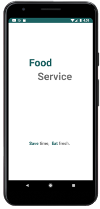
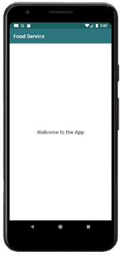

# Android App Library: Splashscreen

## About
Welcome to our Android application. The app is part of the Open Sorce [Android App Library](https://github.com/LukPle/android-app-library.git) 
and adopts all licensing and community guidelines from this project. Please use the link in order to check out the corresponding repository.

The splashscreen app shows a simple spalshscreen by using a **Handler** to delay an **Intent**.
The application serves as an example of this feature.

## Features
The setting of the app is a food service. The user can see a splashscreen with the logo of the delivery service for 4 seconds at the start of the application.
After that time the user gets to the next screen.  

## Usage
You can clone the repository into Android Studio by clicking "Get from VCS" in the Welcome Screen or navigating to "File - New - Project from Version Control" inside 
the IDE. When doing so use the URL provided by GitHub. You can run the app on your mobile device or an emulator. Feel free to modify the code or utilize this sample 
for your own project.
